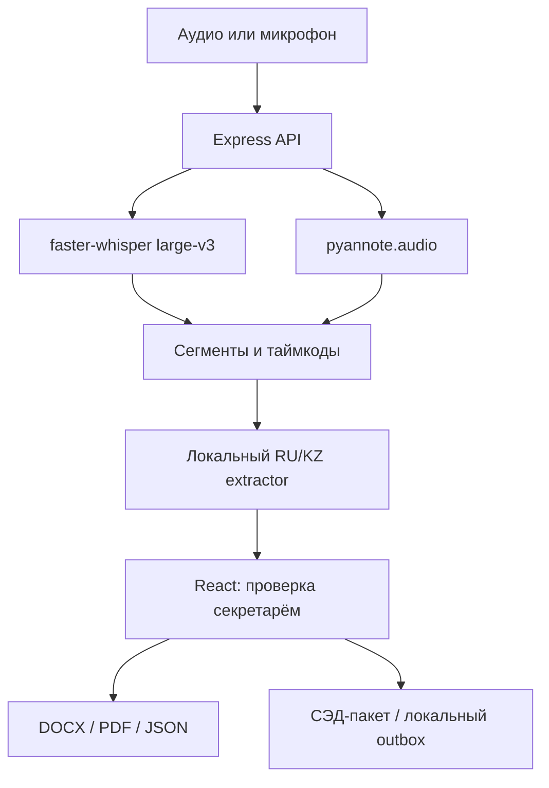

# Meeting Assistant — локальный автопротокол совещаний

<<<<<<< HEAD
Meeting Assistant — локальный веб-сервис для автоматического протоколирования совещаний. Система распознаёт русскую, казахскую и смешанную речь, разделяет реплики по говорящим, выделяет поручения, ответственных и сроки, формирует краткое саммари и создаёт проверяемый черновик протокола. Секретарь может редактировать результат, отмечать проверенные данные, управлять статусами поручений и экспортировать протокол в PDF, DOCX или JSON. Обработка выполняется в фоновом режиме внутри закрытого контура: аудио и текст не передаются во внешние API или облачные сервисы.

> Результат нельзя считать утверждённым протоколом без проверки человеком. Имена, формулировки поручений и сроки могут быть распознаны неверно.

## Что реализовано

- загрузка MP3, WAV, M4A и OGG через адаптивный веб-интерфейс;
- локальное multilingual speech-to-text на русском, казахском и смешанной речи через `faster-whisper`;
- локальная диаризация через `pyannote.audio` и привязка сегментов по временному пересечению;
- ручная привязка `SPEAKER_00` к имени участника;
- выделение русских и казахских поручений, сроков и ответственных;
- evidence и флаг `needs_review` у каждого кандидата;
- саммари, метрики, транскрипт и экспорт PDF/DOCX/JSON;
- встроенный редактор: исправление названия, саммари, поручений, ответственных и сроков;
- современный responsive UI с drag-and-drop загрузкой, loading overlay, toast-уведомлениями и карточками поручений;
- статусы поручений «черновик / в работе / просрочено / выполнено» и отметка проверки секретарём;
- стабильные ID поручений: evidence сохраняется при сортировке и редактировании карточек;
- защита от одновременного перезаписывания через версию `revision` и ответ `409 Conflict`;
- мини-дашборд по всем протоколам, поиск и фильтрация поручений по статусу;
- проверка реального формата аудио по сигнатуре файла, а не только по расширению;
- неблокирующий запуск тяжёлых ASR/диаризации, gzip и защитные HTTP-заголовки;
- фоновая очередь обработки с сохраняемым job-статусом и прогрессом по этапам;
- поиск и пагинация истории через параметры `q`, `limit` и `offset`;
- локальная история последних 50 протоколов и повторное открытие результата;
- атомарное обновление JSON/PDF/DOCX без частично записанных файлов;
- два воспроизводимых demo-сценария по выданным письменным эталонам — без AI-моделей;
- лимит 100 МБ, валидация, безопасные ID и удаление исходного аудио после обработки;
- health endpoint и автоматические тесты.

## Пользовательский сценарий

1. Секретарь уведомляет участников о записи и получает согласие.
2. Загружает запись, указывает название и при необходимости соответствие голосовых меток именам.
3. Сервер локально выполняет ASR и диаризацию.
4. Модуль извлечения формирует черновик поручений и саммари.
5. Секретарь проверяет отмеченные поля и скачивает PDF, DOCX или JSON.

Для быстрой демонстрации достаточно нажать «Совещание №1» или «Совещание №2»: полный сценарий экспорта выполнится по эталонному тексту.

## Архитектура

```text
Browser -> FastAPI -> faster-whisper -> pyannote.audio
        -> speaker overlap -> action/deadline rules
        -> review draft -> PDF + DOCX + JSON
```

```text
app/main.py        API, валидация, хранение и endpoints
app/core.py        ASR, диаризация, извлечение и экспорт
app/index.html     семантическая HTML-разметка веб-интерфейса
app/static/        отдельные CSS и JavaScript frontend-модули
demo.py            offline smoke demo по эталонам
tests/             unit- и API-тесты извлечения, редактора и экспорта
examples/          эталонные тексты и предоставленное аудио
outputs/           результаты демонстрации
```

## Установка и запуск

Требования: Python 3.11/3.12 и `ffmpeg` в `PATH`.

### Быстрый demo без моделей

```powershell
py -m venv .venv
.venv\Scripts\Activate.ps1
pip install -r requirements.txt
uvicorn app.main:app --host 127.0.0.1 --port 8000
```

Откройте `http://127.0.0.1:8000` и выберите один из двух demo-примеров.

### Обработка реального аудио

```powershell
pip install -r requirements-audio.txt
$env:ASR_MODEL_DIR = "$PWD\models\faster-whisper-small"
$env:DIARIZATION_MODEL_DIR = "$PWD\models\pyannote-speaker-diarization"
uvicorn app.main:app --host 127.0.0.1 --port 8000
```

`ASR_MODEL_DIR` должен содержать полностью скачанную CTranslate2-модель Whisper. `DIARIZATION_MODEL_DIR` должен быть локальной pipeline-конфигурацией pyannote со всеми зависимыми весами. Код не скачивает модели во время обработки. На Linux активируйте окружение через `source .venv/bin/activate`, а переменные задайте через `export`.

## Проверка

```powershell
pip install -r requirements-dev.txt
python -m unittest discover -s tests -v
python demo.py
```

`demo.py` создаёт файлы в `outputs/demo_1` и `outputs/demo_2`. Это проверка извлечения и экспорта по письменным эталонам, а не оценка ASR. Для end-to-end проверки установите обе модели и загрузите файлы из `examples/audio/`.

Health check: `GET http://127.0.0.1:8000/health`.

Основные API endpoints: `POST /process`, `GET /jobs/{id}`, `POST /demo/{id}`, `GET /dashboard`, `GET /reports?q=&limit=50&offset=0`, `GET /reports/{id}`, `PUT /reports/{id}` и `GET /download/{id}/{kind}`. `POST /process` возвращает `202 Accepted`, после чего клиент следит за job до готовности. PUT принимает версию `revision`, только проверяемые поля и сохраняет исходный evidence и транскрипт.

## Технологии, данные и приватность

Python, FastAPI, faster-whisper/CTranslate2, pyannote.audio, TorchAudio, ffmpeg, python-docx и ReportLab. Используются только предоставленные аудиозаписи и письменные протоколы. Внешние API и облачная передача данных отсутствуют. Реальные записи для демонстрации должны быть анонимизированы. Веса моделей и лицензии в репозиторий не входят.

## Ограничения и развитие

- локальные модели нужно подготовить отдельно; CPU-обработка может быть медленной;
- диаризация выдаёт технические метки, а не надёжную биометрическую идентификацию;
- rule-based извлечение может пропускать поручения или создавать ложные кандидаты;
- нет live-подключения к Teams/Zoom/Meet, СЭД, напоминаний, авторизации и production-хранилища;
- следующий этап: редактор подтверждения, локальная LLM, нормализация дат, очередь задач и аудит доступа.

Deployed-версия отсутствует: прототип предназначен для локального запуска в закрытом контуре.
=======
Прототип для транскрибации русской, казахской и смешанной речи, диаризации участников, извлечения поручений и экспорта протокола в DOCX/PDF/JSON. Аудио и текст обрабатываются внутри контура: внешних AI API в проекте нет.

## Что действительно реализовано

- загрузка MP3/WAV/M4A/OGG/WebM/MP4 до настраиваемого лимита;
- запись с микрофона браузера и отправка в тот же локальный pipeline;
- локальный ASR на `faster-whisper` (`large-v3` по умолчанию);
- локальная диаризация на `pyannote.audio` с привязкой каждого сегмента к `SPEAKER_*`;
- ручное сопоставление `SPEAKER_00` с ФИО и массовое переименование в интерфейсе;
- извлечение поручений, ответственных и сроков для RU/KZ и смешанных формулировок;
- пометка неполных поручений как «Требует проверки»;
- редактирование стенограммы, саммари и поручений секретарём;
- статусы, приоритеты, категории и фильтры;
- управленческий command center: полнота данных, этапы обработки, срочные и ближайшие поручения;
- RU/KZ-календарь сроков: просрочка, приближение срока и локальные браузерные напоминания;
- дашборд исполнения со статусами «в работе / просрочено / выполнено»;
- центр интеграций: версионированный пакет СЭД, персональные выдержки и локальный RAM-outbox;
- автоматическое локальное сохранение последнего протокола между перезагрузками;
- экспорт в DOCX, печатную PDF-форму и JSON;
- три встроенных демонстрационных протокола и импорт готового текста;
- health-check, который показывает реальную готовность ASR и диаризации.

Важно: приложение не выдаёт демо-протокол за результат обработки загруженного аудио. Если локальные модели не настроены, API возвращает понятную ошибку `LOCAL_ASR_UNAVAILABLE`.

## Архитектура



`server.ts` сохраняет загрузку во временный каталог ОС, запускает `scripts/transcribe_local.py`, получает JSON и удаляет временный файл в блоке `finally`. Python-процесс использует word timestamps для разбиения реплики на границах спикеров; если timestamps слов недоступны, применяется сопоставление сегмента по максимальному временному пересечению с pyannote.

## Быстрый запуск на Windows

Рекомендуемая версия — **Node.js 22 LTS** с npm. Поддерживаемый Vite диапазон: Node.js `^20.19.0` либо `>=22.12.0`. Python, FFmpeg и ML-модели для просмотра интерфейса не требуются.

### Запуск одним файлом

1. Полностью распакуйте архив, например в `C:\meeting-assistant`. Не запускайте проект прямо внутри ZIP.
2. Дважды щёлкните `START_WINDOWS.cmd` либо запустите его из PowerShell:

   ```powershell
   Set-Location "C:\meeting-assistant"
   .\START_WINDOWS.cmd
   ```

3. При первом запуске скрипт создаст `.env` из `.env.windows.example`, установит зависимости и после готовности сервера откроет браузер.
4. Не закрывайте окно запуска. Для остановки сервера нажмите `Ctrl+C`.

Рабочий адрес — [http://localhost:3000](http://localhost:3000). Адрес `0.0.0.0` используется только для привязки сетевого сервера и не предназначен для открытия в браузере.

Без Python и весов моделей работают встроенные демо, импорт RU/KZ/mixed-текста, извлечение поручений, редактирование и экспорт DOCX/PDF/JSON. Статус «Требуется настройка моделей» в окне On-Premise при таком запуске ожидаем.

### Ручной запуск из PowerShell

Команда `npm.cmd` используется намеренно: она работает даже тогда, когда политика PowerShell запрещает выполнение `npm.ps1`.

```powershell
Set-Location "C:\путь\к\распакованному\проекту"
if (-not (Test-Path .env)) { Copy-Item .env.windows.example .env }
npm.cmd ci --include=dev --no-audit --no-fund
npm.cmd run dev
```

Не вводите текст `C:\путь\к\...` буквально — подставьте фактическую папку, в которой находится `package.json`. После первого успешного запуска достаточно выполнить `START_WINDOWS.cmd` или `npm.cmd run dev`.

### Linux/macOS

```bash
cp .env.example .env
npm ci
npm run dev
```

### Проверка проекта

В PowerShell:

```powershell
npm.cmd run verify
npm.cmd run benchmark
```

`verify` выполняет TypeScript-проверку, 40 автоматических тестов и production-сборку. Benchmark содержит шесть эталонных формулировок: по две RU, KZ и mixed. Дополнительные regression-тесты воспроизводят сложные конструкции из двух предоставленных протоколов: контекстный адресат, несколько поручений в реплике, подразделение как исполнитель и словесная дата. Результат `6/6` проверяет extractor, но не заменяет WER/DER-оценку реального аудио.

## Настройка локального распознавания аудио на Windows

Для настоящей обработки аудио дополнительно нужны:

- Python 3.11 x64 (поддерживаются версии 3.10–3.12);
- `ffmpeg.exe` и `ffprobe.exe`, доступные через `PATH`;
- полный локальный каталог faster-whisper/CTranslate2 `large-v3`;
- локальный pipeline pyannote с настоящим `config.yaml` и всеми весами, на которые он ссылается;
- несколько гигабайт свободного места; для быстрой обработки рекомендуется NVIDIA GPU, CPU подходит главным образом для короткого демо.

Создайте окружение без активации PowerShell-скриптов:

```powershell
Set-Location "C:\meeting-assistant"
py -3.11 -m venv .venv
.\.venv\Scripts\python.exe -m pip install --upgrade pip
.\.venv\Scripts\python.exe -m pip install -r requirements-ml.txt
ffmpeg -version
ffprobe -version
```

Разместите модели, например так:

```text
models/
├── faster-whisper-large-v3/
│   ├── config.json
│   ├── model.bin
│   └── ...
└── pyannote-speaker-diarization-3.1/
    ├── config.yaml
    └── ...
```

`config.yaml` — это файл, а не имя каталога. Для полностью закрытого контура одного этого файла недостаточно: локально должны присутствовать snapshot pipeline, segmentation/embedding checkpoints и остальные зависимости, указанные в конфигурации. Веса не входят в архив проекта из-за размера и условий распространения.

Если `.env` ещё не создан, скопируйте Windows-шаблон. Затем проверьте пути:

```powershell
if (-not (Test-Path .env)) { Copy-Item .env.windows.example .env }
notepad .env
```

Основные значения:

```dotenv
ASR_PYTHON=.venv/Scripts/python.exe
WHISPER_MODEL=./models/faster-whisper-large-v3
WHISPER_DEVICE=cpu
WHISPER_COMPUTE_TYPE=int8
DIARIZATION_MODEL=./models/pyannote-speaker-diarization-3.1/config.yaml
ALLOW_MODEL_DOWNLOAD=false
```

Пути с прямыми слешами корректны в Windows. В закрытом контуре оставьте `ALLOW_MODEL_DOWNLOAD=false`: Python-процесс принудительно работает в offline-режиме. Если организация отдельно разрешила первоначальную загрузку на подключённой машине, её нужно выполнить заранее, принять условия доступа к моделям pyannote и затем перенести полный локальный snapshot в контур. Само приложение не подменяет отсутствующие веса облачным API.

Убедитесь, что Python-пакеты установлены:

```powershell
.\.venv\Scripts\python.exe -c "import faster_whisper, pyannote.audio; print('Python ML dependencies: OK')"
```

Запустите приложение в первом окне PowerShell:

```powershell
.\START_WINDOWS.cmd
```

Пока сервер работает, запросите health-check во втором окне:

```powershell
Set-Location "C:\meeting-assistant"
curl.exe -s http://localhost:3000/api/health
```

Полностью готовый контур возвращает `"status":"ok"`, `"asr_model":true` и `"diarization_model":true`. Ответ `503` со статусом `degraded` означает, что сервер и демо работают, но в деталях перечислена отсутствующая часть ML-контура.

По умолчанию один файл ограничен 100 МБ и 4 часами (`MAX_AUDIO_MB`, `MAX_AUDIO_DURATION_SECONDS`); длительность проверяется до загрузки моделей, декодирование ограничено на уровне FFmpeg, а `MAX_CONCURRENT_ASR_JOBS=1` защищает локальный CPU/GPU от параллельного переполнения.

### Linux host

```bash
python3 -m venv .venv
. .venv/bin/activate
pip install -r requirements-ml.txt
cp .env.example .env
npm ci
npm run dev
```

В `.env` укажите существующие локальные пути к каталогу CTranslate2 и файлу pyannote `config.yaml`.

### Docker

Положите локальные модели в `./models`, скопируйте `.env.example` в `.env`, проверьте пути `/models/...`, затем:

```bash
docker compose up --build
```

Каталог моделей монтируется read-only. Сборка образа требует заранее доступных npm/pip-пакетов, а runtime-инференс при `ALLOW_MODEL_DOWNLOAD=false` выполняется без внешних модельных API. Образ большой, поскольку включает PyTorch, Whisper и pyannote.

## Устранение проблем в Windows

### PowerShell не находит папку проекта

Корень проекта — это уже та папка, где лежит `package.json`; дополнительной вложенной папки `meeting-assistant` может не быть. Проверьте текущую папку:

```powershell
Get-Location
Test-Path .\package.json
```

Если результат `True`, оставайтесь в этой папке и запускайте `.\START_WINDOWS.cmd`. Если `False`, найдите фактический каталог:

```powershell
Get-ChildItem "$env:USERPROFILE\Desktop" -Filter package.json -File -Recurse -ErrorAction SilentlyContinue | Select-Object -ExpandProperty DirectoryName
```

### PowerShell запрещает `npm.ps1`

Сообщение «выполнение сценариев отключено в этой системе» относится к обёртке `npm.ps1`. Не меняйте системную политику: используйте `START_WINDOWS.cmd` или команды `npm.cmd`.

### `SIGINT`, `process terminated` или вопрос о завершении пакетного файла

`SIGINT` означает, что установка была прервана, обычно нажатием `Ctrl+C` или закрытием окна. Дождитесь возвращения строки `PS C:\...>`; первая установка может занять несколько минут. После прерывания зависимости могут остаться неполными — снова запустите `START_WINDOWS.cmd`.

### `Cannot find package 'tsx'` / `ERR_MODULE_NOT_FOUND`

Пакет `tsx` относится к dev-зависимостям. Такая ошибка означает незавершённую установку либо установку без dev-зависимостей:

```powershell
Set-Location "C:\путь\к\проекту"
Remove-Item Env:NODE_ENV -ErrorAction SilentlyContinue
npm.cmd install --include=dev --no-audit --no-fund
npm.cmd run dev
```

### `EPERM: operation not permitted` при очистке `node_modules`

Отдельное предупреждение `npm warn cleanup ... EPERM` не всегда фатально — сначала дождитесь итогового результата npm. Если установка завершилась ошибкой:

1. Остановите старый сервер через `Ctrl+C` и закройте редакторы/терминалы, использующие эту папку.
2. Находясь именно в папке проекта, удалите только локальный `node_modules` и повторите установку:

   ```powershell
   Test-Path .\package.json
   cmd /c rmdir /s /q node_modules
   npm.cmd cache verify
   npm.cmd ci --include=dev --no-audit --no-fund
   ```

3. Если каталог всё ещё заблокирован, перезагрузите Windows и повторите команды до открытия VS Code. Не отключайте антивирус и не удаляйте каталоги вне проекта.

Путь с кириллицей поддерживается приложением и не являлся причиной ошибки `tsx`. Если сторонний Python/FFmpeg-инструмент всё же некорректно работает с таким путём, распакуйте проект в короткий ASCII-путь, например `C:\meeting-assistant`.

### Сайт не открывается

- окно `START_WINDOWS.cmd` или `npm.cmd run dev` должно оставаться открытым;
- открывайте `http://localhost:3000`, а не `http://0.0.0.0:3000`;
- если указан другой `PORT` в `.env`, используйте его, например `http://localhost:3001`;
- ошибка `EADDRINUSE` означает занятый порт: остановите предыдущий экземпляр либо измените `PORT` в `.env` и запустите снова;
- если сервер завершился, читайте первую ошибку в окне запуска, а не сообщение браузера.

### On-Premise показывает `degraded`

Это ожидаемо для UI-only запуска. Откройте детали health-check: он отдельно проверяет Python-пакеты, локальный каталог Whisper, файл `config.yaml`, зависимости pyannote и наличие FFmpeg в `PATH`.

## Основной сценарий демонстрации

1. Откройте «On-Premise» и покажите фактический статус обеих моделей.
2. Загрузите короткую анонимизированную запись RU/KZ или запишите 30–60 секунд с микрофона.
3. Покажите транскрипт с таймкодами и метками `SPEAKER_*`.
4. Переименуйте спикера: имя обновится в транскрипте и связанных поручениях.
5. На command center покажите полноту протокола, срочные поручения и этап проверки.
6. Откройте поручение: продемонстрируйте цитату-основание, ответственного, срок и флаг проверки.
7. Исправьте одно поле и нажмите «Одобрить все».
8. Включите локальные напоминания и покажите счётчики «просрочено / скоро».
9. Экспортируйте DOCX и PDF.
10. После утверждения откройте «Интеграции»: поставьте пакет СЭД и персональные выдержки в локальный outbox, затем скачайте единый JSON-контракт.

Если ML-модели недоступны на машине жюри, используйте «Вставить текст» и казахский пример — это честный резервный сценарий проверки NLP и экспорта, а не имитация ASR. Полный текст выступления находится в `DEMO_SCRIPT.md`.

Результат проверки на предоставленных MP3/DOCX, найденные дефекты и границы проверки зафиксированы в `REFERENCE_VALIDATION.md`.

## Формат текста для импорта

Имя спикера указывается отдельной строкой:

```text
Протокол совещания
Тема: Производственная безопасность

Қанат Бауыржанұлы
Марат Серікұлы, до пятницы қауіпсіздік есебін дайындау.

Марат Серікұлы
Түсінікті, есепті жұмаға дейін жіберемін.
```

На этом примере фиксируются говорящий `Қанат Бауыржанұлы`, ответственный `Марат Серікұлы`, смешанная формулировка задачи и срок `до пятницы`.

## API

| Метод | Маршрут | Назначение |
|---|---|---|
| `GET` | `/api/health` | Реальная готовность локальных моделей |
| `GET` | `/api/demo/1..3` | Демо-протоколы RU/KZ |
| `POST` | `/api/analyze-text` | Анализ готовой стенограммы |
| `POST` | `/api/process-audio` | Локальный ASR + диаризация + извлечение поручений |
| `GET` | `/api/integrations/outbox` | Метаданные локальных операций, без текста протокола |
| `POST` | `/api/integrations/outbox` | Mock-коннектор СЭД/рассылки; только для утверждённого протокола |

Пример аудио-запроса:

```bash
curl -F 'audio=@meeting.wav' \
  -F 'title=Еженедельное совещание' \
  -F 'organization=Тестовая организация' \
  -F 'speakers={"SPEAKER_00":"Айдана Серікқызы"}' \
  http://localhost:3000/api/process-audio
```

## Как извлекаются поручения

Детерминированный extractor ищет:

- RU-глаголы: `подготовить`, `провести`, `согласовать`, `проверить`, `направить` и другие;
- KZ-глаголы: `дайындау`, `жасау`, `өткізу`, `тексеру`, `жіберу`, `келісу`, `ұйымдастыру` и формы вежливого императива;
- сроки: даты, дни недели, «до конца недели», `бір апта ішінде`, `келесі аптада`, `10 қазанға дейін`;
- исполнителя после `ответственный/жауапты` или перед глаголом в прямом обращении.

Каждое поручение хранит `speaker` и `evidence`. Неясный исполнитель или срок не выдумывается: поле получает значение «Не указан / көрсетілмеген», а `needs_review` становится `true`.

## Дополнительные возможности и границы

| Возможность | Статус прототипа |
|---|---|
| СЭД | Рабочий локальный контракт `meeting-assistant.sed.v1`, checksum и RAM-outbox; адаптер конкретной СЭД не входит в обязательную часть |
| Дашборд статусов | Реализован: pending / in progress / completed плюс вычисляемая просрочка и ближайший срок |
| Выдержки ответственным | Автоматически группируются по исполнителю и ставятся в локальный outbox; корпоративные адреса должны приходить из защищённого справочника |
| Срочность и направление | Реализованы классификация, ручная корректировка и фильтры |
| Голосовая идентификация | Не включена: есть диаризация и ручное подтверждение имени; биометрия требует согласия, локального реестра и отдельной оценки рисков |
| On-premise | Реализован локальный pipeline без внешних AI API; Docker и Windows-инструкция включены |

Mock-outbox не отправляет письма и не обращается к СЭД. Он доказывает API-контракт, проверку утверждения, формирование персональных пакетов и privacy-friendly журналирование. В RAM сохраняются только ID операции, тип, время и количество элементов; текст протокола не хранится.

## Безопасность

- нет SDK и вызовов внешних AI API;
- аудио пишется только во временный каталог и удаляется после обработки, включая ошибки;
- аргументы Python-процесса передаются через `spawn`, без shell-интерполяции;
- размер загрузки ограничен, расширения и MIME проверяются;
- модели можно смонтировать read-only;
- утверждение секретарём остаётся обязательным human-in-the-loop шагом.

Для промышленной эксплуатации дополнительно нужны аутентификация/роли, журнал аудита, антивирусная проверка загрузок, секрет-хранилище, TLS на reverse proxy, резервное копирование БД и политика хранения утверждённых протоколов.

## Ограничения прототипа

- подключение ботом к Teams/Zoom/Google Meet не реализовано; доступны файл и микрофон;
- для СЭД реализован mock-коннектор и контракт, но адаптер конкретного вендора не реализован;
- локальные браузерные напоминания работают только при открытом приложении; промышленный scheduler, e-mail и корпоративные каналы рассылки пока не подключены;
- голосовая биометрическая идентификация отсутствует: pyannote разделяет голоса, имя назначает секретарь;
- rule-based extractor прозрачен и проверяем, но уступает локальной LLM на сложных косвенных поручениях;
- качество code-switching зависит от качества записи и выбранной Whisper-модели;
- полная аудио-верификация требует локальных весов моделей, которые не включены в архив из-за размера и лицензирования.

## Структура

```text
server.ts                    Express API и orchestration
START_WINDOWS.cmd            запуск и восстановление зависимостей в Windows
.env.windows.example         шаблон конфигурации Windows host
scripts/transcribe_local.py  faster-whisper + pyannote
src/services/analyzer.ts     RU/KZ извлечение и статистика
src/services/reportBuilder.ts тестируемая сборка ASR-результата в протокол
src/services/exportService.ts DOCX/PDF/JSON
src/services/integrationService.ts СЭД-контракт и персональные выдержки
src/components/              интерфейс секретаря
src/data/mockData.ts         три демонстрационных протокола
tests/                       автоматические тесты и benchmark-фикстуры
AUDIT.md                     оценка до/после и оставшиеся риски
DEMO_SCRIPT.md               сценарий защиты
REFERENCE_VALIDATION.md      проверка на двух предоставленных совещаниях
```

## Полезные команды

Windows PowerShell:

```powershell
npm.cmd run dev       # development server
npm.cmd run lint      # TypeScript
npm.cmd test          # unit-тесты
npm.cmd run benchmark # RU/KZ/mixed regression benchmark
npm.cmd run build     # production bundle
npm.cmd run verify    # все проверки
```

Linux/macOS:

```bash
npm run dev       # development server
npm run lint      # TypeScript
npm test          # unit-тесты
npm run benchmark # RU/KZ/mixed regression benchmark
npm run build     # production bundle
npm run verify    # все проверки
```
>>>>>>> 620a53f (Meeting Assistant: рабочий прототип)
